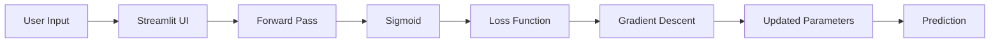
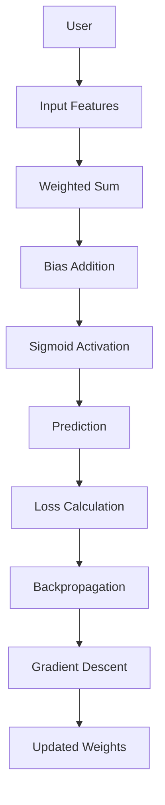

<!-- ====================================================== -->
<!--                     PROJECT BANNER                     -->
<!-- ====================================================== -->

<p align="center">

# 🧠 Artificial Neuron (Perceptron) From Scratch

### *Understanding the Fundamental Building Block of Deep Learning Through Mathematics, NumPy, and Interactive Visualization*


</p>

---

<p align="center">


</p>

---

<p align="center">

## 🚀 Live Demo

🌐 **Streamlit App**

https://artificial-neuron-from-scratch-bqvlvuvlhqchvjbywrplsj.streamlit.app

💻 **GitHub Repository**

https://github.com/SHALINISAURAV/artificial-neuron-from-scratch

</p>

---

# 📖 Project Overview

Artificial Intelligence has transformed modern computing, yet many learners rely on high-level frameworks like TensorFlow and PyTorch without truly understanding **how a neuron actually learns**.

This project bridges that gap.

It implements an **Artificial Neuron (Perceptron)** completely from scratch using only **Python** and **NumPy**, recreating every important mathematical operation involved in neural computation.

Instead of treating neural networks as black boxes, this project exposes every computational step—from weighted summation and activation functions to loss calculation, gradient computation, and parameter optimization.

To make learning intuitive, the project also provides an **interactive Streamlit interface**, allowing users to experiment with neuron parameters in real time and observe how different weights, biases, and inputs influence predictions.

The result is an educational yet production-quality implementation that demonstrates both the mathematics and engineering behind the fundamental building block of Deep Learning.

---

# 🎯 Motivation

Modern Deep Learning libraries abstract away most mathematical operations.

Although this accelerates development, it often prevents beginners from understanding what actually happens inside a neural network.

This project was built with three primary objectives:

- Build an Artificial Neuron entirely from mathematical principles.
- Visualize every stage of forward propagation and learning.
- Create an interactive educational tool for students, developers, and AI enthusiasts.

Rather than depending on pre-built neural network libraries, every operation has been manually implemented to maximize conceptual clarity.

---

# 🧬 Biological Inspiration

Artificial Neural Networks are inspired by biological neurons found in the human brain.

A biological neuron receives electrical signals from dendrites, processes them inside the cell body, and transmits information through its axon.

Similarly, an artificial neuron performs four fundamental operations:

```text
Biological Neuron

Dendrites
      │
      ▼
Receive Signals
      │
      ▼
Cell Body
      │
      ▼
Process Information
      │
      ▼
Axon
      │
      ▼
Transmit Signal
```

Equivalent Artificial Neuron

```text
Inputs (x)

↓

Weights (w)

↓

Weighted Sum

↓

Bias

↓

Activation Function

↓

Prediction
```

This project recreates this computational model from first principles.

---

# ✨ Key Features

## Mathematical Implementation

- Artificial Neuron implemented completely from scratch
- Pure NumPy implementation
- No TensorFlow
- No PyTorch
- Matrix-based computations
- Vectorized implementation

---

## Interactive Learning

- Adjustable Inputs
- Adjustable Weights
- Adjustable Bias
- Adjustable Learning Rate
- Real-Time Prediction
- Live Mathematical Computation

---

## Visualization

- Interactive Network Graph
- Dynamic Weight Updates
- Forward Pass Visualization
- Training Visualization
- Loss Monitoring

---

## Machine Learning

- Sigmoid Activation
- Mean Squared Error Loss
- Gradient Descent Optimization
- Backpropagation
- Binary Classification

---

# 🖼️ Demo

## Interactive Interface

Users can modify:

- Input Values
- Weights
- Bias
- Learning Rate

and immediately observe

- Linear Combination
- Activation Output
- Prediction
- Parameter Updates

without writing a single line of code.

---

## Screenshots

```text
assets/

├── home.png
├── neuron.png
├── training.png
├── prediction.png
├── loss_curve.png
```

---

# 🏗️ System Architecture



---

# 🔄 Workflow



---

# ⚙️ Technology Stack

| Layer | Technology | Purpose |
|---------|------------|----------|
| Programming Language | Python | Core Implementation |
| Numerical Computing | NumPy | Matrix Operations |
| UI Framework | Streamlit | Interactive Dashboard |
| Visualization | Plotly | Interactive Graphs |
| Version Control | Git | Source Management |
| Hosting | Streamlit Cloud | Deployment |

---

# 📂 Repository Structure

```text
artificial-neuron-from-scratch/

│

├── app.py

├── README.md

├── requirements.txt

├── .gitignore

│

├── assets/

│ ├── banner.png

│ ├── screenshots/

│ └── icons/

│

└── utils/

      ├── neuron.py

      ├── activation.py

      ├── loss.py

      └── visualization.py
```

---

# 🚀 Installation

## Clone Repository

```bash
git clone https://github.com/SHALINISAURAV/artificial-neuron-from-scratch.git
```

Move inside the project

```bash
cd artificial-neuron-from-scratch
```

Create Virtual Environment

```bash
python -m venv venv
```

Activate

Windows

```bash
venv\Scripts\activate
```

Linux / Mac

```bash
source venv/bin/activate
```

Install Dependencies

```bash
pip install -r requirements.txt
```

Run Application

```bash
streamlit run app.py
```

The application will automatically open in your browser.

---

# ▶️ Usage

1. Launch the Streamlit application.
2. Modify input values using the sliders.
3. Adjust weights and bias.
4. Observe the weighted sum calculation.
5. View the activation output.
6. Train the neuron using Gradient Descent.
7. Monitor loss reduction.
8. Compare predictions on logic gate datasets.
