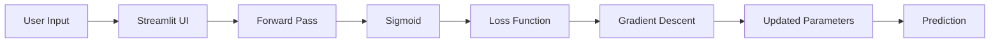
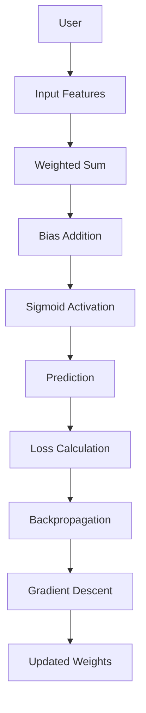

<p align="center">


# 🧠 Artificial Neuron (Perceptron) From Scratch

### Building the Foundation of Deep Learning Using Pure Mathematics, NumPy & Interactive Visualization

</p>

---

<p align="center">


</p>

## 🚀 Live Demo

🌐 **Streamlit App**

https://artificial-neuron-from-scratch-bqvlvuvlhqchvjbywrplsj.streamlit.app

💻 **GitHub Repository**

https://github.com/SHALINISAURAV/artificial-neuron-from-scratch

</p>

---

# 📖 Project Overview

Artificial Intelligence has transformed modern computing, yet many learners rely on high-level frameworks like TensorFlow and PyTorch without truly understanding **how a neuron actually learns**.

This project bridges that gap.

It implements an **Artificial Neuron (Perceptron)** completely from scratch using only **Python** and **NumPy**, recreating every important mathematical operation involved in neural computation.

Instead of treating neural networks as black boxes, this project exposes every computational step—from weighted summation and activation functions to loss calculation, gradient computation, and parameter optimization.

To make learning intuitive, the project also provides an **interactive Streamlit interface**, allowing users to experiment with neuron parameters in real time and observe how different weights, biases, and inputs influence predictions.

The result is an educational yet production-quality implementation that demonstrates both the mathematics and engineering behind the fundamental building block of Deep Learning.

---

# 🎯 Motivation

Modern Deep Learning libraries abstract away most mathematical operations.

Although this accelerates development, it often prevents beginners from understanding what actually happens inside a neural network.

This project was built with three primary objectives:

- Build an Artificial Neuron entirely from mathematical principles.
- Visualize every stage of forward propagation and learning.
- Create an interactive educational tool for students, developers, and AI enthusiasts.

Rather than depending on pre-built neural network libraries, every operation has been manually implemented to maximize conceptual clarity.

---

# 🧬 Biological Inspiration

Artificial Neural Networks are inspired by biological neurons found in the human brain.

A biological neuron receives electrical signals from dendrites, processes them inside the cell body, and transmits information through its axon.

Similarly, an artificial neuron performs four fundamental operations:

```text
Biological Neuron

Dendrites
      │
      ▼
Receive Signals
      │
      ▼
Cell Body
      │
      ▼
Process Information
      │
      ▼
Axon
      │
      ▼
Transmit Signal
```

Equivalent Artificial Neuron

```text
Inputs (x)

↓

Weights (w)

↓

Weighted Sum

↓

Bias

↓

Activation Function

↓

Prediction
```

This project recreates this computational model from first principles.

---

# ✨ Key Features

## Mathematical Implementation

- Artificial Neuron implemented completely from scratch
- Pure NumPy implementation
- No TensorFlow
- No PyTorch
- Matrix-based computations
- Vectorized implementation

---

## Interactive Learning

- Adjustable Inputs
- Adjustable Weights
- Adjustable Bias
- Adjustable Learning Rate
- Real-Time Prediction
- Live Mathematical Computation

---

## Visualization

- Interactive Network Graph
- Dynamic Weight Updates
- Forward Pass Visualization
- Training Visualization
- Loss Monitoring

---

## Machine Learning

- Sigmoid Activation
- Mean Squared Error Loss
- Gradient Descent Optimization
- Backpropagation
- Binary Classification

---

# 🖼️ Demo

## Interactive Interface

Users can modify:

- Input Values
- Weights
- Bias
- Learning Rate

and immediately observe

- Linear Combination
- Activation Output
- Prediction
- Parameter Updates

without writing a single line of code.

---

## Screenshots

```text
assets/

├── home.png
├── neuron.png
├── training.png
├── prediction.png
├── loss_curve.png
```

---

# 🏗️ System Architecture



---

# 🔄 Workflow



---

# ⚙️ Technology Stack

| Layer | Technology | Purpose |
|---------|------------|----------|
| Programming Language | Python | Core Implementation |
| Numerical Computing | NumPy | Matrix Operations |
| UI Framework | Streamlit | Interactive Dashboard |
| Visualization | Plotly | Interactive Graphs |
| Version Control | Git | Source Management |
| Hosting | Streamlit Cloud | Deployment |

---

# 📂 Repository Structure

```text
artificial-neuron-from-scratch/

│

├── app.py

├── README.md

├── requirements.txt

├── .gitignore

│

├── assets/

│ ├── banner.png

│ ├── screenshots/

│ └── icons/

│

└── utils/

      ├── neuron.py

      ├── activation.py

      ├── loss.py

      └── visualization.py
```

---

# 🚀 Installation

## Clone Repository

```bash
git clone https://github.com/SHALINISAURAV/artificial-neuron-from-scratch.git
```

Move inside the project

```bash
cd artificial-neuron-from-scratch
```

Create Virtual Environment

```bash
python -m venv venv
```

Activate

Windows

```bash
venv\Scripts\activate
```

Linux / Mac

```bash
source venv/bin/activate
```

Install Dependencies

```bash
pip install -r requirements.txt
```

Run Application

```bash
streamlit run app.py
```

The application will automatically open in your browser.

---

# ▶️ Usage

1. Launch the Streamlit application.
2. Modify input values using the sliders.
3. Adjust weights and bias.
4. Observe the weighted sum calculation.
5. View the activation output.
6. Train the neuron using Gradient Descent.
7. Monitor loss reduction.
8. Compare predictions on logic gate datasets.

---

# 🧮 Mathematical Foundation

The Artificial Neuron computes its output through four sequential mathematical operations:

1. Linear Combination
2. Activation Function
3. Loss Computation
4. Parameter Optimization

These operations collectively allow the neuron to learn patterns from data.

---

## 1️⃣ Forward Propagation

The neuron first computes the weighted sum of all input features and adds a bias term.

\[
z = \sum_{i=1}^{n}(w_i x_i)+b
\]

or in vectorized notation

\[
z=\mathbf{W}^{T}\mathbf{X}+b
\]

where

| Symbol | Meaning |
|---------|----------|
| X | Input Vector |
| W | Weight Vector |
| b | Bias |
| z | Linear Combination |

---

## 2️⃣ Activation Function

The weighted sum is passed through the Sigmoid activation function.

\[
\sigma(z)=\frac{1}{1+e^{-z}}
\]

This converts any real-valued number into a probability between **0 and 1**.

Output Range

```
Negative Large Number  → 0

0                     → 0.5

Positive Large Number → 1
```

### Numerical Stability

To prevent overflow inside NumPy,

\[
z = clip(z,-500,500)
\]

before computing the exponential.

---

## 3️⃣ Loss Function

This implementation uses Mean Squared Error (MSE).

\[
L=\frac1N\sum(\hat y-y)^2
\]

where

| Symbol | Meaning |
|---------|----------|
| y | Actual Label |
| ŷ | Predicted Output |

---

## 4️⃣ Backpropagation

Learning happens by calculating gradients using the Chain Rule.

Gradient of Sigmoid

\[
\sigma'(z)=\sigma(z)(1-\sigma(z))
\]

Gradient of Loss

\[
\frac{\partial L}{\partial z}
=
(\hat y-y)\sigma'(z)
\]

Weight Gradient

\[
\frac{\partial L}{\partial W}
=
X^T
\frac{\partial L}{\partial z}
\]

Bias Gradient

\[
\frac{\partial L}{\partial b}
=
\sum
\frac{\partial L}{\partial z}
\]

---

## 5️⃣ Gradient Descent

Parameters are updated after every iteration.

Weights

\[
W=W-\alpha\frac{\partial L}{\partial W}
\]

Bias

\[
b=b-\alpha\frac{\partial L}{\partial b}
\]

where

α = Learning Rate

---

# 🧠 Implementation Details

The neuron has been implemented entirely from scratch without relying on any machine learning frameworks.

Every computational step has been manually written using NumPy.

The implementation includes:

- Forward Propagation
- Sigmoid Activation
- Loss Calculation
- Gradient Computation
- Gradient Descent
- Parameter Updates
- Prediction

No hidden APIs are used.

---

# 📊 Dataset

This project demonstrates learning using classic Boolean Logic datasets.

## AND Gate

| X₁ | X₂ | Output |
|---:|---:|-------:|
|0|0|0|
|0|1|0|
|1|0|0|
|1|1|1|

---

## OR Gate

| X₁ | X₂ | Output |
|---:|---:|-------:|
|0|0|0|
|0|1|1|
|1|0|1|
|1|1|1|

---

These datasets are intentionally simple because the goal is to understand the learning mechanism rather than maximize predictive performance.

---

# ⚙️ Training Pipeline

```text
Dataset

↓

Initialize Weights

↓

Forward Pass

↓

Prediction

↓

Loss

↓

Gradient Calculation

↓

Update Weights

↓

Repeat Until Convergence
```

---

# 📈 Training Process

Each training iteration performs the following steps:

1. Compute weighted sum.
2. Apply sigmoid activation.
3. Predict output.
4. Compute MSE loss.
5. Calculate gradients.
6. Update weights.
7. Repeat until convergence.

---

# 📊 Results

The perceptron successfully learns linearly separable datasets such as:

- AND Gate
- OR Gate

The model demonstrates:

- Stable convergence
- Decreasing loss
- Improved prediction accuracy
- Correct decision boundary formation

---

# 🧪 Experiments

| Experiment | Observation |
|------------|-------------|
| Increase Learning Rate | Faster learning but risk of instability |
| Decrease Learning Rate | Stable but slower convergence |
| Zero Bias | Reduced flexibility |
| Random Initialization | Different convergence paths |
| Extreme Inputs | Sigmoid saturation observed |

---

# 📉 Performance Analysis

The project demonstrates:

✅ Successful gradient descent

✅ Correct weight updates

✅ Stable sigmoid output

✅ Smooth convergence

✅ Vectorized implementation

---

# 🎯 Limitations

A single perceptron can only solve **linearly separable problems**.

Examples it can solve:

- AND
- OR

Examples it cannot solve:

- XOR

This limitation motivated the development of Multi-Layer Perceptrons (MLPs), which use hidden layers and non-linear representations.

---

# ⚖️ Engineering Decisions

This project prioritizes **educational clarity**, **mathematical transparency**, and **code simplicity**.

| Decision | Reason |
|----------|--------|
| NumPy instead of TensorFlow | Understand every mathematical operation |
| Streamlit UI | Interactive experimentation |
| Sigmoid Activation | Easy visualization of probabilities |
| Mean Squared Error | Simple loss function for educational purposes |
| Gradient Descent | Demonstrates optimization fundamentals |
| Vectorized Computation | Faster and cleaner implementation |

---

# 🚧 Challenges Faced

During development, several engineering challenges were encountered.

### Numerical Overflow

Computing

exp(-z)

for very large values caused overflow warnings.

**Solution**

Clip z before exponentiation.

---

### Stable Learning

Large learning rates caused oscillation.

**Solution**

Expose the learning rate as a user-adjustable parameter.

---

### Interactive Visualization

Updating graphs in real time while maintaining responsiveness required efficient rendering.

**Solution**

Use Plotly with Streamlit for dynamic visualizations.

---

# 🚀 Future Improvements

Planned enhancements include:

- Multi-Layer Perceptron (MLP)
- ReLU Activation
- Softmax Classifier
- Mini-Batch Gradient Descent
- Cross Entropy Loss
- Decision Boundary Visualization
- Weight Heatmaps
- Training Animation
- TensorBoard-style Dashboard
- Model Serialization
- Custom Dataset Upload
- Multi-Class Classification
- GPU Acceleration
- PyTorch Version Comparison

---

# 📚 Key Learnings

This project provided practical understanding of:

- Artificial Neurons
- Linear Algebra
- Matrix Multiplication
- Forward Propagation
- Sigmoid Activation
- Loss Functions
- Gradient Descent
- Chain Rule
- Backpropagation
- Numerical Stability
- Vectorization using NumPy
- Interactive AI Visualization
- Streamlit Application Development

---

# 💼 Interview Questions

### Fundamentals

1. What is an Artificial Neuron?
2. Why is bias necessary?
3. Why are weights initialized randomly?
4. What is forward propagation?
5. What is backpropagation?
6. Why do we use activation functions?
7. What is gradient descent?
8. Why does sigmoid suffer from vanishing gradients?
9. Why can't a perceptron solve XOR?
10. Difference between MSE and Cross-Entropy?

### Engineering

11. Why implement with NumPy instead of TensorFlow?
12. Why clip values before exponentiation?
13. Why vectorize matrix operations?
14. What happens when the learning rate is too high?
15. What happens if bias is removed?

### Advanced

16. How would you extend this to an MLP?
17. How does PyTorch compute gradients automatically?
18. Why is ReLU preferred in deep networks?
19. What causes exploding gradients?
20. How would you optimize this implementation for large datasets?

---

# 📖 References

### Books

- Deep Learning — Goodfellow, Bengio & Courville
- Neural Networks and Learning Machines — Simon Haykin
- Pattern Recognition and Machine Learning — Christopher Bishop

### Papers

- Rosenblatt, F. (1958). *The Perceptron: A Probabilistic Model for Information Storage and Organization in the Brain.*

### Documentation

- NumPy Documentation
- Streamlit Documentation
- Plotly Documentation

---

# 🤝 Contributing

Contributions are welcome.

If you have ideas for improving the implementation, documentation, or visualization:

1. Fork the repository.
2. Create a feature branch.
3. Commit your changes.
4. Push the branch.
5. Open a Pull Request.

---

# 📄 License

This project is licensed under the **MIT License**.

---

# 👩‍💻 Author

## Shalini Saurav

AI • Machine Learning • Deep Learning • Computational Neuroscience

🔗 GitHub

https://github.com/SHALINISAURAV

🔗 Project Repository

https://github.com/SHALINISAURAV/artificial-neuron-from-scratch

🌐 Live Demo

https://artificial-neuron-from-scratch-bqvlvuvlhqchvjbywrplsj.streamlit.app

---

# ⭐ If you found this project useful...

Please consider giving this repository a ⭐ on GitHub.

It helps others discover the project and motivates future open-source development.

---

<p align="center">

Made with ❤️ using Python, NumPy, Streamlit and a passion for understanding AI from first principles.

</p>
